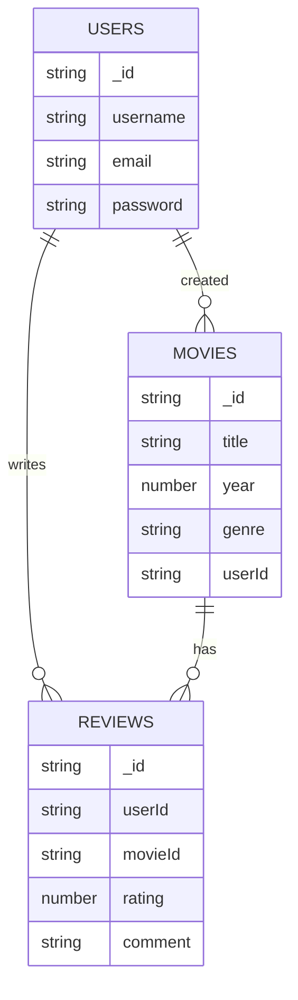
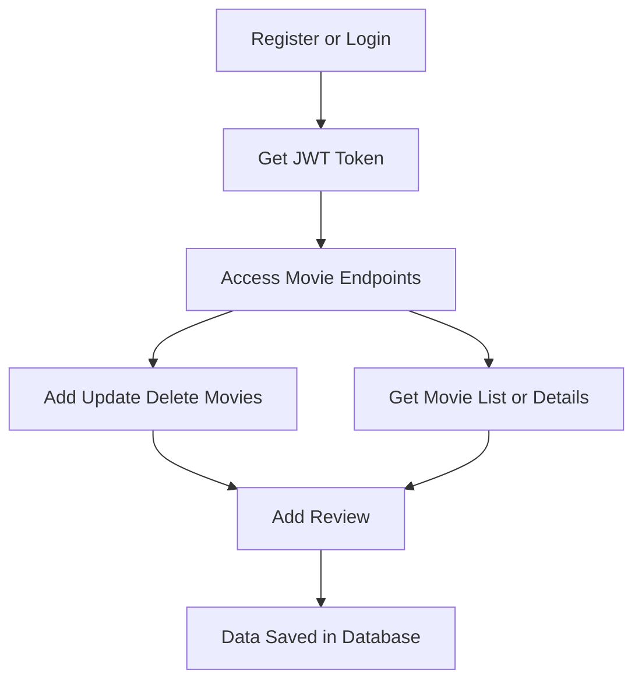

# Movie-Watching-API

A robust API for managing and tracking movie-watching activities. This repository provides endpoints to create, update, retrieve, and delete movie records, as well as user authentication and review management. This documentation covers installation, requirements, introduction, features, configuration, and detailed usage instructions.

---

## Installation

Install and set up the Movie-Watching-API with these steps:

- Clone the repository:
  ```bash
  git clone https://github.com/ZAWAD1/Movie-Watching-API.git
  cd Movie-Watching-API
  ```
- Install dependencies:
  ```bash
  npm install
  ```
- Set up environment variables by copying the example file:
  ```bash
  cp .env.example .env
  ```
- Configure your `.env` file with your database and secret values.
- Start the development server:
  ```bash
  npm run dev
  ```
- For production:
  ```bash
  npm run build
  npm start
  ```

---

## Requirements

Before running this API, ensure you have the following:

- Node.js (version 22 or higher)
- npm (version 6 or higher)
- Neon database instance (PostgreSQL)
- A modern web browser or API client (for testing)
- Environment variables set up in a `.env` file

---

## Introduction

Movie-Watching-API enables users to manage their movie collections, track films they have watched, post reviews, and interact with others. The API is built with Node.js and Express, using a Neon database for persistent storage. It follows RESTful conventions, supporting JSON request and response formats for easy integration with frontend or mobile clients.

---

## Features

This API offers the following features:

- User registration and authentication (JWT-based)
- Movie CRUD operations (create, read, update, delete)
- Review system for movies
- Personalized watchlists and history tracking
- Secure password storage (bcrypt)
- Input validation and error handling
- Modular code structure for scalability

---

## Configuration

To configure the API:

- Edit the `.env` file with your specific settings:
  - `PORT`: Port number for the server (default: 3000)
  - `DATABASE_URL`: Neon database connection string
  - `JWT_SECRET`: Secret key for JWT token signing
- Review and adjust configuration files as needed for custom environments.
- Optionally, configure CORS and other Express middlewares in `app.js`.

---

## Usage

After installation and configuration, interact with the API using an HTTP client (e.g., Postman, curl) or integrate it with your frontend. Below are the main endpoints and their usage.

---

### User Registration (POST /api/auth/register)

Registers a new user in the system.

```api
{
    "title": "Register User",
    "description": "Create a new user account with email and password.",
    "method": "POST",
    "baseUrl": "http://localhost:3000",
    "endpoint": "/api/auth/register",
    "headers": [
        {
            "key": "Content-Type",
            "value": "application/json",
            "required": true
        }
    ],
    "queryParams": [],
    "pathParams": [],
    "bodyType": "json",
    "requestBody": "{\n  \"email\": \"user@example.com\",\n  \"password\": \"password123\",\n  \"username\": \"user01\"\n}",
    "formData": [],
    "responses": {
        "201": {
            "description": "Registration successful",
            "body": "{\n  \"message\": \"User registered successfully\"\n}"
        },
        "400": {
            "description": "Validation error",
            "body": "{\n  \"error\": \"Email already exists\"\n}"
        }
    }
}
```

---

### User Login (POST /api/auth/login)

Authenticates a user and returns a JWT for future requests.

```api
{
    "title": "User Login",
    "description": "Authenticate user and return JWT token.",
    "method": "POST",
    "baseUrl": "http://localhost:3000",
    "endpoint": "/api/auth/login",
    "headers": [
        {
            "key": "Content-Type",
            "value": "application/json",
            "required": true
        }
    ],
    "queryParams": [],
    "pathParams": [],
    "bodyType": "json",
    "requestBody": "{\n  \"email\": \"user@example.com\",\n  \"password\": \"password123\"\n}",
    "formData": [],
    "responses": {
        "200": {
            "description": "Login successful",
            "body": "{\n  \"token\": \"<jwt_token>\"\n}"
        },
        "401": {
            "description": "Invalid credentials",
            "body": "{\n  \"error\": \"Invalid email or password\"\n}"
        }
    }
}
```

---

### Get All Movies (GET /api/movies)

Fetch all movies in the database.

```api
{
    "title": "Get All Movies",
    "description": "Retrieve a list of all movies.",
    "method": "GET",
    "baseUrl": "http://localhost:3000",
    "endpoint": "/api/movies",
    "headers": [
        {
            "key": "Authorization",
            "value": "Bearer <token>",
            "required": true
        }
    ],
    "queryParams": [
        {
            "key": "page",
            "value": "Pagination page number",
            "required": false
        }
    ],
    "pathParams": [],
    "bodyType": "none",
    "requestBody": "",
    "formData": [],
    "responses": {
        "200": {
            "description": "List of movies",
            "body": "{\n  \"movies\": [\n    { \"title\": \"Inception\", \"year\": 2010 }, ...\n  ]\n}"
        }
    }
}
```

---

### Add a Movie (POST /api/movies)

Add a new movie to the collection.

```api
{
    "title": "Add Movie",
    "description": "Create a new movie entry in the database.",
    "method": "POST",
    "baseUrl": "http://localhost:3000",
    "endpoint": "/api/movies",
    "headers": [
        {
            "key": "Authorization",
            "value": "Bearer <token>",
            "required": true
        },
        {
            "key": "Content-Type",
            "value": "application/json",
            "required": true
        }
    ],
    "queryParams": [],
    "pathParams": [],
    "bodyType": "json",
    "requestBody": "{\n  \"title\": \"The Matrix\",\n  \"year\": 1999,\n  \"genre\": \"Sci-Fi\"\n}",
    "formData": [],
    "responses": {
        "201": {
            "description": "Movie created",
            "body": "{\n  \"movie\": { \"title\": \"The Matrix\", \"year\": 1999 }\n}"
        },
        "400": {
            "description": "Validation error",
            "body": "{\n  \"error\": \"Missing required fields\"\n}"
        }
    }
}
```

---

### Get Single Movie (GET /api/movies/:id)

Retrieve a movie by its unique identifier.

```api
{
    "title": "Get Movie By ID",
    "description": "Get detailed information about a specific movie.",
    "method": "GET",
    "baseUrl": "http://localhost:3000",
    "endpoint": "/api/movies/:id",
    "headers": [
        {
            "key": "Authorization",
            "value": "Bearer <token>",
            "required": true
        }
    ],
    "queryParams": [],
    "pathParams": [
        {
            "key": "id",
            "value": "Movie ID",
            "required": true
        }
    ],
    "bodyType": "none",
    "requestBody": "",
    "formData": [],
    "responses": {
        "200": {
            "description": "Movie details",
            "body": "{\n  \"movie\": { \"title\": \"The Matrix\", \"year\": 1999 }\n}"
        },
        "404": {
            "description": "Not found",
            "body": "{\n  \"error\": \"Movie not found\"\n}"
        }
    }
}
```

---

### Update Movie (PUT /api/movies/:id)

Update an existing movie’s details.

```api
{
    "title": "Update Movie",
    "description": "Modify an existing movie record.",
    "method": "PUT",
    "baseUrl": "http://localhost:3000",
    "endpoint": "/api/movies/:id",
    "headers": [
        {
            "key": "Authorization",
            "value": "Bearer <token>",
            "required": true
        },
        {
            "key": "Content-Type",
            "value": "application/json",
            "required": true
        }
    ],
    "queryParams": [],
    "pathParams": [
        {
            "key": "id",
            "value": "Movie ID",
            "required": true
        }
    ],
    "bodyType": "json",
    "requestBody": "{\n  \"title\": \"The Matrix Reloaded\",\n  \"year\": 2003\n}",
    "formData": [],
    "responses": {
        "200": {
            "description": "Movie updated",
            "body": "{\n  \"movie\": { \"title\": \"The Matrix Reloaded\", \"year\": 2003 }\n}"
        },
        "404": {
            "description": "Movie not found",
            "body": "{\n  \"error\": \"Movie not found\"\n}"
        }
    }
}
```

---

### Delete Movie (DELETE /api/movies/:id)

Delete a movie from the collection.

```api
{
    "title": "Delete Movie",
    "description": "Remove a movie from the database.",
    "method": "DELETE",
    "baseUrl": "http://localhost:3000",
    "endpoint": "/api/movies/:id",
    "headers": [
        {
            "key": "Authorization",
            "value": "Bearer <token>",
            "required": true
        }
    ],
    "queryParams": [],
    "pathParams": [
        {
            "key": "id",
            "value": "Movie ID",
            "required": true
        }
    ],
    "bodyType": "none",
    "requestBody": "",
    "formData": [],
    "responses": {
        "200": {
            "description": "Movie deleted",
            "body": "{\n  \"message\": \"Movie deleted successfully\"\n}"
        },
        "404": {
            "description": "Movie not found",
            "body": "{\n  \"error\": \"Movie not found\"\n}"
        }
    }
}
```

---

### Add Review (POST /api/movies/:id/reviews)

Submit a review for a specific movie.

```api
{
    "title": "Add Movie Review",
    "description": "Add a review for a movie.",
    "method": "POST",
    "baseUrl": "http://localhost:3000",
    "endpoint": "/api/movies/:id/reviews",
    "headers": [
        {
            "key": "Authorization",
            "value": "Bearer <token>",
            "required": true
        },
        {
            "key": "Content-Type",
            "value": "application/json",
            "required": true
        }
    ],
    "queryParams": [],
    "pathParams": [
        {
            "key": "id",
            "value": "Movie ID",
            "required": true
        }
    ],
    "bodyType": "json",
    "requestBody": "{\n  \"rating\": 5,\n  \"comment\": \"Amazing movie!\"\n}",
    "formData": [],
    "responses": {
        "201": {
            "description": "Review added",
            "body": "{\n  \"review\": { \"rating\": 5, \"comment\": \"Amazing movie!\" }\n}"
        },
        "400": {
            "description": "Validation error",
            "body": "{\n  \"error\": \"Invalid input\"\n}"
        }
    }
}
```

---

## Data Model Overview

The API uses a Neon PostgreSQL database for users, movies, and reviews. Relationships are managed via references in database records.



---

## API Flow Overview

The following flow illustrates a typical user interaction with the API:



---
